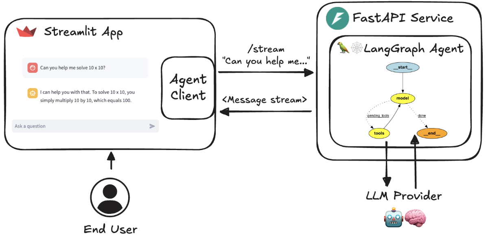
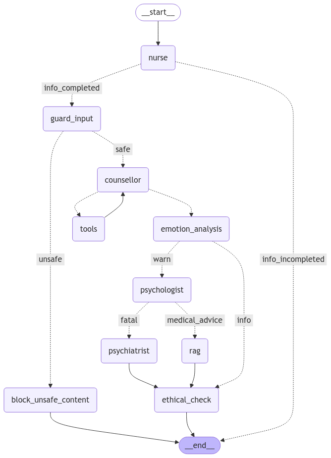

# MentalHealthChatbot
A diagnostic robot for early mental health consultation.

### Product



## Architecture View


Blue: Initially completed modules

Orange: TODO


### call stack

```
st.chat_input -> UserInput -> 
    HumanMessage -> 
        Chat Model (agents graph) -> 
    AIMessage/ToolMessage ->
ChatMessage -> st.chat_message
```

### Flow




# Design

## Agent

### edge

- get structured output 

https://python.langchain.com/docs/how_to/structured_output/

### node

- TODO extraction / prompt trim output
https://python.langchain.com/docs/tutorials/extraction/

- long memory

https://python.langchain.com/docs/versions/migrating_memory/long_term_memory_agent/

- cross thread memory TODO
https://langchain-ai.github.io/langgraph/concepts/memory/#what-is-memory

- multimodal TODO: read img/video/voice...

https://python.langchain.com/docs/how_to/multimodal_inputs/


nurse agent 

https://python.langchain.com/docs/tutorials/classification/

https://python.langchain.com/docs/tutorials/summarization/

### Features

ICEL
https://python.langchain.com/docs/how_to/lcel_cheatsheet/

parallel is rag ?
https://python.langchain.com/docs/how_to/parallel/

fallback: deal with error when crash
https://python.langchain.com/docs/how_to/fallbacks/

prompt
https://python.langchain.com/docs/how_to/prompts_composition/

cache: decrease cost and latency
https://python.langchain.com/docs/how_to/chat_model_caching/

calculate cost
https://python.langchain.com/docs/how_to/chat_token_usage_tracking/

TODO retriever 
https://python.langchain.com/docs/how_to/#retrievers

TODO custom
https://python.langchain.com/docs/how_to/#custom

TODO cookbook
https://github.com/langchain-ai/langchain/tree/master/cookbook

https://github.com/langchain-ai/langchain/blob/master/cookbook/two_agent_debate_tools.ipynb
