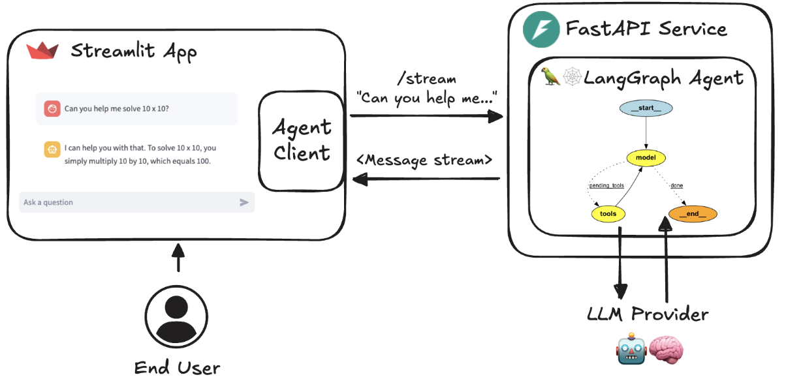
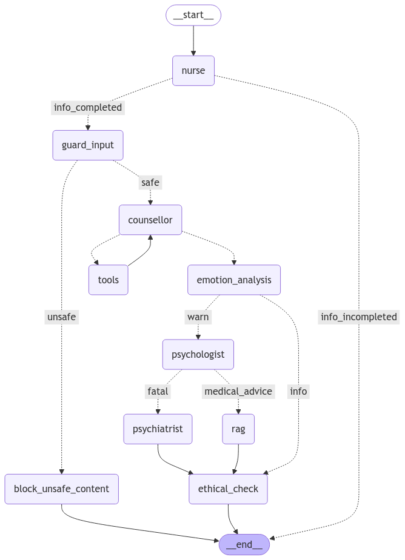

# MentalHealthChatbot
A diagnostic robot for early mental health consultation.

### Product

## Architecture View

Blue: Initially completed modules

Orange: TODO

### How to run the code

0. install pyenv and poetry

0. set .env

    OPENAI_API_KEY="YOUR API KEY"

0. install python 3.11.6

    $ pyenv install 3.11.6

0. install dependency

    $ poetry install

0. run back-end python server

    $ cd src; poetry run python run_service.py

0. run front-end web server

    $ cd src; poetry run streamlit run streamlit_app.py 

### Flow

